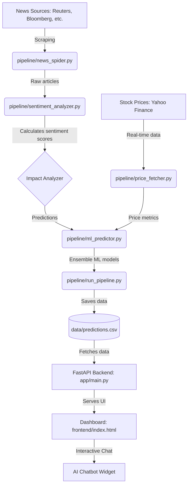

# 📈 News Sentiment Based Stock Predictor

A high-performance, real-time stock analysis engine that combines massive news scraping (5000+ articles), advanced VADER sentiment analysis, and Machine Learning to predict stock market impacts.

---

## 🏗 System Architecture & Pipeline

The following diagram illustrates the data flow from raw news sources to final stock recommendations:



---

## 🛠 Project Components & File Structure

### 📡 Data Pipeline (`/pipeline`)
| File | Responsibility |
| :--- | :--- |
| **`news_spider.py`** | Scrapy spider for high-speed news collection. |
| **`sentiment_analyzer.py`** | VADER-based scoring and fuzzy deduplication. |
| **`impact_analyzer.py`** | Causal reasoning engine for stock/sector correlation. |
| **`price_fetcher.py`** | Yahoo Finance client for real-time and historical data. |
| **`ml_predictor.py`** | Ensemble of 6 ML models (XGBoost, Random Forest, etc.). |
| **`run_pipeline.py`** | Main orchestrator to run the full stack end-to-end. |

### 🌐 Application & UI
| Directory | Description |
| :--- | :--- |
| **`/app`** | FastAPI backend providing API endpoints for the dashboard. |
| **`/frontend`** | Modern dashboard with real-time charts and a floating AI chat widget. |
| **`/data`** | Persistent storage for scraped news, prices, and predictions. |

---

## 🚀 Getting Started

### 1. Installation
Install the necessary dependencies:
```bash
pip install -r requirements.txt
```

### 2. Start the Backend
```bash
python -m uvicorn app.main:app --host 0.0.0.0 --port 8000 --reload
```

### 3. Run the Data Pipeline
To refresh the predictions and analysis:
```bash
python pipeline/run_pipeline.py
```

---

## ✨ Key Features
- ✅ **Ultra-Fast Scraping**: 5000+ articles in ~30 seconds.
- ✅ **Intelligent Sentiment**: VADER analysis with sector-aware impact weighting.
- ✅ **Modern UI**: Dark-mode glassmorphism dashboard.
- ✅ **Interactive AI**: Floating chatbot for stocks-specific insights.
- ✅ **Robust Predictions**: Ensemble ML approach for higher reliability.
