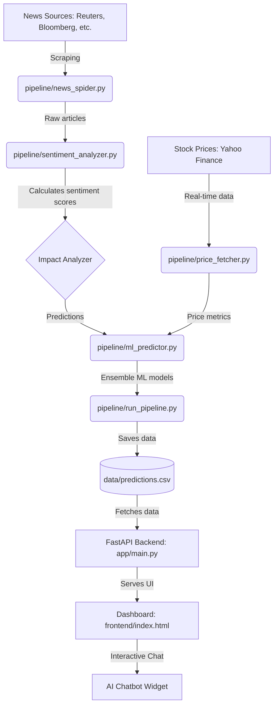

# 📈 News Sentiment Based Stock Predictor

A high-performance, real-time stock analysis engine that combines massive news scraping (5000+ articles), advanced VADER sentiment analysis, and Machine Learning to predict stock market impacts.

---

## ⚖️ License & Copyright

**Project:** News Sentiment Based Stock Predictor  
**Copyright © 2026 Basabjeet Deb. All Rights Reserved.**

This software is proprietary and confidential. Unauthorized copying, distribution, modification, or use of this software is strictly prohibited and will result in legal action. See [LICENSE](LICENSE) file for full terms.

For licensing inquiries: basabjeet.557@gmail.com

---

## 🏗 System Architecture & Pipeline

The following diagram illustrates the data flow from raw news sources to final stock recommendations:



---

## 🛠 Project Components & File Structure

### 📡 Data Pipeline (`/pipeline`)
| File | Responsibility |
| :--- | :--- |
| **`news_spider.py`** | Scrapy spider for high-speed news collection. |
| **`sentiment_analyzer.py`** | VADER-based scoring and fuzzy deduplication. |
| **`impact_analyzer.py`** | Causal reasoning engine for stock/sector correlation. |
| **`price_fetcher.py`** | Yahoo Finance client for real-time and historical data. |
| **`ml_predictor.py`** | Ensemble of 6 ML models (XGBoost, Random Forest, etc.). |
| **`run_pipeline.py`** | Main orchestrator to run the full stack end-to-end. |

### 🌐 Application & UI
| Directory | Description |
| :--- | :--- |
| **`/app`** | FastAPI backend providing API endpoints for the dashboard. |
| **`/frontend`** | Modern dashboard with real-time charts and a floating AI chat widget. |
| **`/data`** | Persistent storage for scraped news, prices, and predictions. |

---

## 🚀 Getting Started

### 1. Installation
Install the necessary dependencies:
```bash
pip install -r requirements.txt
```

### 2. Start the Backend
```bash
python -m uvicorn app.main:app --host 0.0.0.0 --port 8000 --reload
```

### 3. Run the Data Pipeline
To refresh the predictions and analysis:
```bash
python pipeline/run_pipeline.py
```

---

## ✨ Key Features
- ✅ **Ultra-Fast Web Scraping**: 5000+ articles in ~30 seconds via Scrapy spiders.
- ✅ **No API Keys Required**: All news data collected through web scraping.
- ✅ **Intelligent Sentiment**: VADER analysis with sector-aware impact weighting.
- ✅ **Modern UI**: Dark-mode glassmorphism dashboard.
- ✅ **Interactive AI**: Floating chatbot for stocks-specific insights.
- ✅ **Robust Predictions**: Ensemble ML approach for higher reliability.


---

## ⚠️ IMPORTANT DISCLAIMERS & LIMITATIONS

### 🎓 Educational Purpose Only

**THIS SOFTWARE IS FOR EDUCATIONAL AND RESEARCH PURPOSES ONLY.**

This application demonstrates sentiment analysis techniques, data visualization, and software engineering practices. It is **NOT** intended for actual trading or investment decisions.

### ⚖️ Not Financial Advice

The predictions, recommendations, and analysis provided by this system **DO NOT constitute financial, investment, or trading advice**. The creator and operators of this system are not licensed financial advisors, brokers, or investment professionals.

**Always consult a licensed financial advisor before making any investment decisions.**

### 📊 Known Limitations & Methodology Constraints

#### Data Quality Issues
- **Limited News Sources**: Scrapes from public sources only; may miss critical information
- **Web Scraping Risks**: Sites can block access (403/401 errors), leading to incomplete data
- **Delisted Tickers**: Some stocks may be delisted or have no price data available
- **Sample Size**: Currently processes 600 articles (RAM-constrained); larger datasets may yield different results
- **No Real-time Updates**: Requires manual pipeline runs; not continuously updated

#### Methodology Limitations
- **Sentiment ≠ Performance**: News sentiment does not reliably predict stock price movements
- **Correlation ≠ Causation**: Positive news does not cause stock prices to rise
- **No Backtesting**: Predictions have not been validated against historical performance
- **No Accuracy Metrics**: No precision, recall, F1 score, or win rate provided
- **Simplified Model**: Uses basic sentiment scoring, not deep learning or advanced ML
- **No Fundamentals**: Ignores P/E ratios, revenue, earnings, debt, and other financial metrics
- **No Technical Analysis**: Does not consider RSI, MACD, moving averages, or chart patterns
- **No Macro Factors**: Ignores Fed rates, GDP, inflation, unemployment, and economic indicators
- **No Risk Management**: No stop-loss, position sizing, or portfolio optimization

#### Technical Constraints
- **RAM Budget**: Limited to ~1GB RAM usage (~600 articles max)
- **CSV Storage**: Not scalable for production; no database
- **No Authentication**: Anyone can access the API (security risk)
- **No HTTPS**: Data transmitted in plain text
- **Rate Limiting**: Generous limits (60 req/min) - not production-ready

### ⚠️ Risk Warning

**TRADING STOCKS INVOLVES SUBSTANTIAL RISK OF LOSS.**

You can lose some or all of your invested capital. Never invest money you cannot afford to lose. Past performance, whether actual or indicated by historical tests of strategies, is **no guarantee of future performance or success**.

### 🔍 Data Accuracy

While we strive for accuracy, we make **NO GUARANTEES** regarding the completeness, accuracy, or timeliness of data. Stock prices, news articles, and sentiment scores may contain errors or be outdated.

**Always verify information from official sources** such as:
- Company investor relations websites
- SEC filings (10-K, 10-Q, 8-K)
- Official stock exchanges (NYSE, NASDAQ)
- Licensed financial data providers

### 📜 No Liability

By using this application, you agree that the creator, **Basabjeet Deb**, and any contributors are **NOT LIABLE** for any losses, damages, or consequences resulting from your use of this system or reliance on its predictions.

### ✅ Recommended Actions Before Trading

1. **Consult a Professional**: Speak with a licensed financial advisor
2. **Do Your Own Research**: Use multiple sources and verify all information
3. **Understand the Risks**: Know what you're getting into
4. **Never Rely Solely on Automation**: Human judgment is essential
5. **Start Small**: If you must trade, start with amounts you can afford to lose
6. **Verify Data**: Cross-check all data with official sources
7. **Consider Fundamentals**: Look at P/E, revenue, earnings, debt, etc.
8. **Use Technical Analysis**: Check RSI, MACD, support/resistance levels
9. **Monitor Macro Factors**: Fed policy, GDP, inflation, etc.
10. **Have an Exit Strategy**: Know when to cut losses

### 🎯 What This System IS Good For

- ✅ Learning about sentiment analysis techniques
- ✅ Understanding web scraping with Scrapy
- ✅ Exploring FastAPI backend development
- ✅ Building interactive dashboards
- ✅ Demonstrating data visualization
- ✅ Portfolio project for software engineering
- ✅ Research into news-sentiment correlation

### ❌ What This System IS NOT Good For

- ❌ Real money trading
- ❌ Professional investment advice
- ❌ Regulatory compliance (SEC, FINRA)
- ❌ Production-scale deployment
- ❌ Guaranteed profits
- ❌ Risk-free investing
- ❌ Replacing human judgment

---

## 📊 Validation & Transparency

### Current Metrics (As of April 2026)

- **Total Predictions**: 166 stocks
- **Articles Analyzed**: 595 (from 11,096 scraped)
- **Coverage Rate**: ~96% (stocks with news data)
- **Average News per Stock**: 3.6 articles
- **High Confidence Predictions**: ~60% (confidence ≥ 0.7)
- **Pipeline Runtime**: ~48 seconds
- **Data Freshness**: Real-time (when pipeline runs)

### Methodology

1. **News Collection**: Scrapy spiders scrape 5000+ articles from public sources
2. **Sentiment Analysis**: VADER sentiment scoring (-1 to +1)
3. **Relevance Filtering**: Removes irrelevant/low-impact news
4. **Price Data**: Yahoo Finance API for current prices
5. **Prediction Score**: Weighted combination of sentiment (70%), price momentum (20%), and news volume (10%)
6. **Recommendation**: Score mapped to STRONG BUY/BUY/HOLD/SELL/STRONG SELL

### No Backtesting Results

**This system has NOT been backtested** against historical data. We do not know:
- Historical accuracy rate
- Win/loss ratio
- Profit/loss performance
- Sharpe ratio
- Maximum drawdown
- Comparison to buy-and-hold strategy

**Without backtesting, predictions should be treated as experimental.**

---

## 🔒 Security & Privacy

### Current Security Status

⚠️ **This application has known security vulnerabilities:**

- No authentication required
- No HTTPS encryption
- CORS allows all origins
- Generous rate limiting
- Sensitive data in git history
- No input sanitization
- CSV file storage (not secure)

**DO NOT use this system with real financial data or in production without addressing these issues.**

See [IMPROVEMENTS.md](IMPROVEMENTS.md) for detailed security recommendations.

---

## 📞 Contact & Support

**Creator**: Basabjeet Deb  
**Email**: basabjeet.557@gmail.com  
**Project**: News Sentiment Based Stock Predictor  
**License**: Proprietary (See LICENSE file)

For licensing inquiries, bug reports, or questions, contact via email.

---

## 📚 Additional Resources

- [IMPROVEMENTS.md](IMPROVEMENTS.md) - Detailed improvement recommendations
- [CHATBOT_FEATURES.md](CHATBOT_FEATURES.md) - AI chatbot documentation
- [TEAM_REPORT.md](TEAM_REPORT.md) - Team handoff documentation
- [UPGRADE_AND_UI_PLAN.md](UPGRADE_AND_UI_PLAN.md) - Performance optimization report
- [QUICK_START.md](QUICK_START.md) - Quick start guide
- [LICENSE](LICENSE) - Full license terms
- [COPYRIGHT_NOTICE.md](COPYRIGHT_NOTICE.md) - Copyright information

---

**© 2026 Basabjeet Deb. All Rights Reserved.**

*This software is provided "as is" without warranty of any kind. Use at your own risk.*
