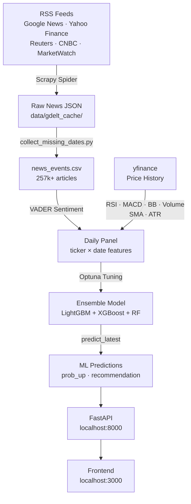
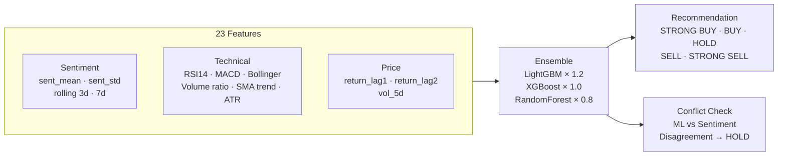
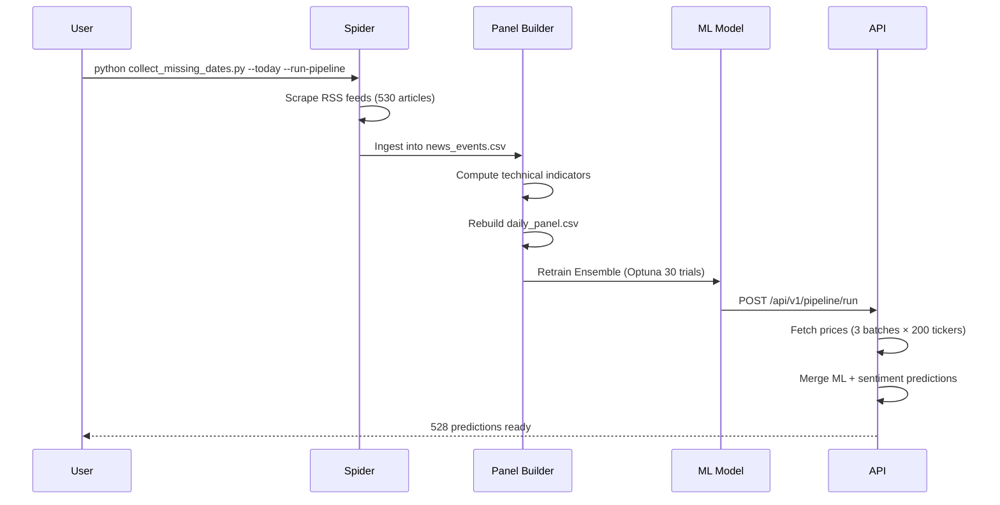

# News Sentiment Based Stock Predictor

> **Proprietary Software** — © 2026 Basabjeet Deb. All rights reserved.  
> Unauthorized copying, distribution, or commercial use is strictly prohibited.  
> See [LICENSE](LICENSE) for full terms.

---

A full-stack AI system that scrapes financial news, analyzes sentiment, computes technical indicators, and generates next-day stock direction predictions using an ensemble ML model.

## ✨ Key Features

- 🤖 **AI Chatbot** — Local LLM integration (LM Studio) for conversational stock analysis
- 📊 **ML Predictions** — Ensemble model (LightGBM + XGBoost + RandomForest) with Optuna tuning
- 📰 **News Analysis** — 257k+ articles from 8 major financial sources with VADER sentiment
- 📈 **Technical Indicators** — RSI, MACD, Bollinger Bands, Volume, SMA, ATR
- 🎨 **Modern UI** — Dark/light themes, skeleton loaders, WCAG 2.1 Level AA accessibility
- ⚡ **Real-time Data** — Live stock prices, candlestick charts, sentiment overlays
- 🔄 **Automated Pipeline** — Daily updates with background processing
- 📱 **Responsive Design** — Mobile-friendly interface with keyboard navigation

---

## Architecture



---

## ML Pipeline



---

## Daily Update Flow



---

## Project Structure

```
├── app/                        # FastAPI backend
│   ├── api/v1/                 # Endpoints: predictions, news, stocks, chat, pipeline, training
│   ├── core/                   # Config, security, thresholds
│   ├── middleware/             # Rate limiting, CORS
│   └── services/               # Business logic: news, predictions, prices, sentiment
│
├── pipeline/                   # ML & data pipeline
│   ├── news_spider.py          # Scrapy spider (RSS feeds, anti-blocking)
│   ├── sentiment_analyzer.py   # VADER sentiment analysis
│   ├── price_fetcher.py        # yfinance batch fetch + 15min disk cache
│   ├── time_series_dataset.py  # Panel builder + technical indicators
│   ├── forecaster.py           # Ensemble model + Optuna tuning
│   └── sector_mapper.py        # Sector/industry cache
│
├── frontend/                   # Vanilla JS SPA
│   ├── index.html              # Dashboard, Predictions, Stocks, News, Analytics, Training
│   ├── app.js                  # All UI logic + AI chatbot + theme toggle
│   ├── styles.css              # Dark/light themes + skeleton loaders + accessibility
│   ├── ticker-names.js         # Ticker autocomplete data
│   └── stock-lookup.js         # Stock search utilities
│
├── data/
│   ├── gdelt_cache/            # 48 dates of raw news (Mar 9 – Apr 25, 2026)
│   ├── news_events.csv         # 257k+ historical articles
│   ├── daily_panel.csv         # ticker × date ML features
│   ├── forecaster_model.pkl    # Trained ensemble model
│   └── forecaster_meta.json    # Model metrics
│
├── collect_missing_dates.py    # Master maintenance script
├── collect_one_date.py         # Single-date spider runner
└── config.py                   # 541 tracked tickers
```

---

## Quick Start

> **For detailed setup instructions, see [SETUP.md](SETUP.md)**

### 1. Install dependencies
```bash
pip install -r requirements.txt
```

### 2. Configure environment variables
```bash
# Copy example file
cp .env.example .env

# Edit .env and set your configuration
# At minimum, set LM_STUDIO_API_TOKEN if using AI chatbot
```

### 3. Setup LM Studio (Optional - for AI Chatbot)
1. Download and install [LM Studio](https://lmstudio.ai/)
2. Load model: `google/gemma-4-e4b` (or any compatible model)
3. Start local server on port 1234
4. Copy API token to `.env` file

### 4. Start the API
```bash
# With LM Studio chatbot
start_backend.bat

# Or manually
python -m uvicorn app.main:app --host 0.0.0.0 --port 8000
```

### 5. Open the app
Navigate to **http://localhost:8000** in your browser

### 6. Run the pipeline
```bash
# Trigger via API
curl -X POST http://localhost:8000/api/v1/pipeline/run

# Or click "Run Pipeline" button in the UI
```

### 7. Daily update (collect today + retrain)
```bash
python collect_missing_dates.py --today --run-pipeline
```

---

## API Endpoints

| Method | Endpoint | Description |
|--------|----------|-------------|
| `GET` | `/api/v1/predictions/` | All predictions (limit, offset, filter) |
| `GET` | `/api/v1/predictions/summary` | Counts by recommendation + sector |
| `GET` | `/api/v1/predictions/{ticker}` | Single stock prediction |
| `GET` | `/api/v1/news/` | Historical news (257k, paginated, filterable) |
| `GET` | `/api/v1/news/summary` | Total count, sentiment distribution |
| `GET` | `/api/v1/stocks/{ticker}/history` | OHLCV candlestick data |
| `POST` | `/api/v1/chat/` | AI chatbot (LM Studio powered) |
| `GET` | `/api/v1/chat/health` | Chatbot health check |
| `POST` | `/api/v1/pipeline/run` | Run full pipeline (background) |
| `GET` | `/api/v1/pipeline/status` | Pipeline progress + last result |
| `POST` | `/api/v1/training/collect-data` | Rebuild ML training data |
| `POST` | `/api/v1/training/train-model` | Retrain forecaster |

Full interactive docs: **http://localhost:8000/docs**

---

## Model Details

| Property | Value |
|----------|-------|
| Algorithm | Ensemble (LightGBM + XGBoost + RandomForest) |
| Tuning | Optuna (30 trials, maximize AUC) |
| Features | 23 (sentiment × 12, technical × 6, price × 3, interaction × 2) |
| Training data | ~2,000 news-covered ticker-day rows |
| Prediction horizon | Next trading day direction (UP / DOWN) |
| Conflict resolution | ML vs sentiment disagreement > 0.3 → HOLD |
| Fallback | Stocks not in panel use sentiment-only probability |

**Technical indicators computed per ticker:**

| Indicator | Description |
|-----------|-------------|
| RSI(14) | Momentum oscillator — overbought/oversold |
| MACD histogram | Trend direction & strength |
| Bollinger Band position | Mean-reversion signal (0=lower, 1=upper) |
| Volume ratio | Current vs 20-day average volume |
| Price trend | 5d SMA / 20d SMA ratio |
| ATR(14) % | Normalised volatility |

---

## News Sources

All news collected via RSS feeds from reputable financial sources:

- Google News Finance
- Yahoo Finance
- Reuters
- CNBC
- MarketWatch
- Barron's
- Seeking Alpha
- The Motley Fool

Anti-blocking measures: user-agent rotation, respectful delays, AutoThrottle, retry logic.

---

## Data Coverage

- **Tickers tracked**: 541 (S&P 500 + major stocks across 11 sectors)
- **Historical cache**: 48 dates (March 9 – April 25, 2026)
- **News events**: 257,760 articles
- **Panel rows**: ~8,000 (ticker × trading day with price labels)
- **Sectors**: Technology, Financial Services, Healthcare, Industrials, Consumer Cyclical, Consumer Defensive, Utilities, Real Estate, Basic Materials, Communication Services, Energy

---

## Frontend Features

### Core Features
- **Dashboard** — top BUY/SELL signals, gainers/losers, sentiment overview
- **AI Predictions** — grid/table view, filter by recommendation/sector/ticker
- **Live Stocks** — real-time prices, sector filter
- **News Feed** — 2,000 articles from full historical store, sentiment/impact filters
- **Analytics** — real model metrics (accuracy, F1, AUC), recommendation distribution, sector sentiment, data quality matrix
- **Stock Modal** — candlestick chart + volume + SMA20/50 + sentiment overlay, ML probability bar

### 🤖 AI Chatbot (LM Studio Integration)
- **Local LLM powered** — Connects to LM Studio (google/gemma-4-e4b)
- **Context-aware** — Receives stock predictions and news data
- **Conversational** — Handles greetings, casual chat, and stock queries
- **Fast responses** — Max 40 words, 10-second timeout
- **Smart fallback** — Rule-based responses when LM Studio unavailable
- **Examples:**
  - "Hey, what are the top picks?" → AI analyzes top buy signals
  - "Tell me about AAPL" → AI provides sentiment and recommendation
  - "Market sentiment?" → AI evaluates overall market trends

### 🎨 UI/UX Enhancements
- **Dark/Light Theme Toggle** — Persistent preference with localStorage
- **Skeleton Loaders** — Smooth loading states with shimmer animations
- **Accessibility (WCAG 2.1 Level AA)**
  - Keyboard navigation (/ for search, Enter/Space for cards)
  - Screen reader support with ARIA labels
  - Skip links and focus indicators
  - High contrast colors in both themes
- **Live Search** — Autocomplete dropdowns on all search bars
- **Responsive Design** — Mobile-friendly layout

---

## AI Chatbot Configuration

The chatbot integrates with LM Studio for local LLM inference.

### Setup

1. **Install LM Studio**: Download from [lmstudio.ai](https://lmstudio.ai/)
2. **Load a model**: Recommended: `google/gemma-4-e4b` (thinking model)
3. **Start server**: Enable local server on port 1234
4. **Configure environment**: Copy `.env.example` to `.env` and set:
   ```env
   LM_STUDIO_API_TOKEN=your_token_here
   LM_STUDIO_URL=http://127.0.0.1:1234/v1/chat/completions
   LM_STUDIO_MODEL=google/gemma-4-e4b
   ```

### Configuration

All settings are loaded from environment variables (see `.env.example`):

```env
LM_STUDIO_URL=http://127.0.0.1:1234/v1/chat/completions
LM_STUDIO_MODEL=google/gemma-4-e4b
LM_STUDIO_TIMEOUT=10.0
LM_STUDIO_MAX_TOKENS=45
LM_STUDIO_TEMPERATURE=0.2
LM_STUDIO_TOP_P=0.8
```

### Features

- **Context-aware**: Receives top stock picks and high-impact news
- **Conversational**: Handles greetings, thanks, casual chat
- **Smart fallback**: Rule-based responses when LM Studio unavailable
- **Fast**: 10-second timeout, max 40 words
- **Source tracking**: Responses tagged with `lm_studio` or `fallback`
- **Secure**: API token loaded from environment variables

### Example Queries

```
User: "Hey, what are the top picks?"
Bot: "Bullish on LMT, NOC, TMUS. Strong buy signals with positive sentiment."

User: "Tell me about AAPL"
Bot: "AAPL: BUY. Bullish sentiment. Confidence 78%."

User: "How are you?"
Bot: "I'm doing great, thanks! Ready to help with stock analysis."
```

### Testing

```bash
# Start backend (loads .env automatically)
start_backend.bat

# Or test via curl
curl -X POST http://localhost:8000/api/v1/chat/ \
  -H "Content-Type: application/json" \
  -d '{"message": "What are the top picks?"}'
```

### Security

- API tokens are **never** hardcoded in source files
- All secrets loaded from `.env` file (excluded from git)
- `.env.example` provides template without sensitive data
- Production deployments use environment-specific configurations

---

## Security & Environment Variables

**All sensitive configuration is managed through environment variables.**

### Setup
1. Copy `.env.example` or `.env.template` to `.env`
2. Fill in your actual API tokens and keys
3. Never commit `.env` to version control (already in `.gitignore`)

### What's Protected
- LM Studio API tokens
- External API keys (Alpha Vantage, FMP)
- Database credentials (future use)
- Production secrets

### Best Practices
- Use strong, unique API tokens
- Rotate tokens regularly
- Use different `.env` files for dev/staging/production
- Never hardcode secrets in source code
- Review `.env.example` for all available options

See [SETUP.md](SETUP.md) for detailed configuration instructions.

---

## Disclaimer

> **This tool is for educational and research purposes only.**  
> It does not constitute financial advice. Predictions are based on news sentiment and technical indicators — not guaranteed to be accurate. Past performance does not predict future results. Always consult a licensed financial advisor before making investment decisions.  
> The authors accept no liability for any financial losses arising from use of this system.

---

## License

Proprietary — © 2026 Basabjeet Deb (basabjeet.557@gmail.com)  
All rights reserved. See [LICENSE](LICENSE) for full terms.
