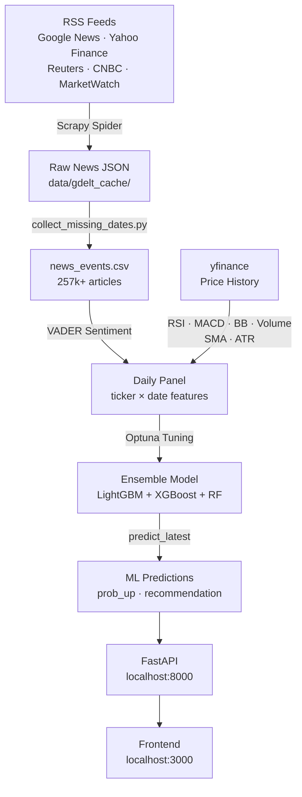
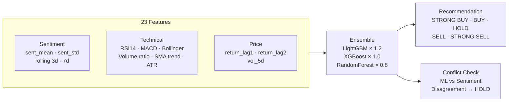
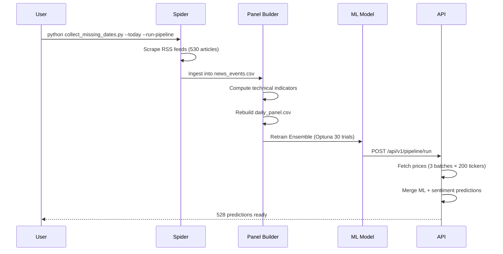

# News Sentiment Based Stock Predictor

> **Proprietary Software** — © 2026 Basabjeet Deb. All rights reserved.  
> Unauthorized copying, distribution, or commercial use is strictly prohibited.  
> See [LICENSE](LICENSE) for full terms.

---

A full-stack AI system that scrapes financial news, analyzes sentiment, computes technical indicators, and generates next-day stock direction predictions using an ensemble ML model.

---

## Architecture



---

## ML Pipeline



---

## Daily Update Flow



---

## Project Structure

```
├── app/                        # FastAPI backend
│   ├── api/v1/                 # Endpoints: predictions, news, stocks, pipeline, training
│   ├── core/                   # Config, security, thresholds
│   ├── middleware/             # Rate limiting, CORS
│   └── services/               # Business logic: news, predictions, prices, sentiment
│
├── pipeline/                   # ML & data pipeline
│   ├── news_spider.py          # Scrapy spider (RSS feeds, anti-blocking)
│   ├── sentiment_analyzer.py   # VADER sentiment analysis
│   ├── price_fetcher.py        # yfinance batch fetch + 15min disk cache
│   ├── time_series_dataset.py  # Panel builder + technical indicators
│   ├── forecaster.py           # Ensemble model + Optuna tuning
│   └── sector_mapper.py        # Sector/industry cache
│
├── frontend/                   # Vanilla JS SPA
│   ├── index.html              # Dashboard, Predictions, Stocks, News, Analytics, Training
│   ├── app.js                  # All UI logic + chatbot
│   └── styles.css
│
├── data/
│   ├── gdelt_cache/            # 48 dates of raw news (Mar 9 – Apr 25, 2026)
│   ├── news_events.csv         # 257k+ historical articles
│   ├── daily_panel.csv         # ticker × date ML features
│   ├── forecaster_model.pkl    # Trained ensemble model
│   └── forecaster_meta.json    # Model metrics
│
├── collect_missing_dates.py    # Master maintenance script
├── collect_one_date.py         # Single-date spider runner
└── config.py                   # 541 tracked tickers
```

---

## Quick Start

### 1. Install dependencies
```bash
pip install -r requirements.txt
```

### 2. Start the API
```bash
python -m uvicorn app.main:app --host 0.0.0.0 --port 8000
```

### 3. Start the frontend
```bash
python -m http.server 3000 --directory frontend
```

### 4. Run the pipeline
```bash
# Trigger via API
curl -X POST http://localhost:8000/api/v1/pipeline/run

# Or open http://localhost:3000 and click Run
```

### 5. Daily update (collect today + retrain)
```bash
python collect_missing_dates.py --today --run-pipeline
```

---

## API Endpoints

| Method | Endpoint | Description |
|--------|----------|-------------|
| `GET` | `/api/v1/predictions/` | All predictions (limit, offset, filter) |
| `GET` | `/api/v1/predictions/summary` | Counts by recommendation + sector |
| `GET` | `/api/v1/predictions/{ticker}` | Single stock prediction |
| `GET` | `/api/v1/news/` | Historical news (257k, paginated, filterable) |
| `GET` | `/api/v1/news/summary` | Total count, sentiment distribution |
| `GET` | `/api/v1/stocks/{ticker}/history` | OHLCV candlestick data |
| `POST` | `/api/v1/pipeline/run` | Run full pipeline (background) |
| `GET` | `/api/v1/pipeline/status` | Pipeline progress + last result |
| `POST` | `/api/v1/training/collect-data` | Rebuild ML training data |
| `POST` | `/api/v1/training/train-model` | Retrain forecaster |

Full interactive docs: **http://localhost:8000/docs**

---

## Model Details

| Property | Value |
|----------|-------|
| Algorithm | Ensemble (LightGBM + XGBoost + RandomForest) |
| Tuning | Optuna (30 trials, maximize AUC) |
| Features | 23 (sentiment × 12, technical × 6, price × 3, interaction × 2) |
| Training data | ~2,000 news-covered ticker-day rows |
| Prediction horizon | Next trading day direction (UP / DOWN) |
| Conflict resolution | ML vs sentiment disagreement > 0.3 → HOLD |
| Fallback | Stocks not in panel use sentiment-only probability |

**Technical indicators computed per ticker:**

| Indicator | Description |
|-----------|-------------|
| RSI(14) | Momentum oscillator — overbought/oversold |
| MACD histogram | Trend direction & strength |
| Bollinger Band position | Mean-reversion signal (0=lower, 1=upper) |
| Volume ratio | Current vs 20-day average volume |
| Price trend | 5d SMA / 20d SMA ratio |
| ATR(14) % | Normalised volatility |

---

## News Sources

All news collected via RSS feeds from reputable financial sources:

- Google News Finance
- Yahoo Finance
- Reuters
- CNBC
- MarketWatch
- Barron's
- Seeking Alpha
- The Motley Fool

Anti-blocking measures: user-agent rotation, respectful delays, AutoThrottle, retry logic.

---

## Data Coverage

- **Tickers tracked**: 541 (S&P 500 + major stocks across 11 sectors)
- **Historical cache**: 48 dates (March 9 – April 25, 2026)
- **News events**: 257,760 articles
- **Panel rows**: ~8,000 (ticker × trading day with price labels)
- **Sectors**: Technology, Financial Services, Healthcare, Industrials, Consumer Cyclical, Consumer Defensive, Utilities, Real Estate, Basic Materials, Communication Services, Energy

---

## Frontend Features

- **Dashboard** — top BUY/SELL signals, gainers/losers, sentiment overview
- **AI Predictions** — grid/table view, filter by recommendation/sector/ticker
- **Live Stocks** — real-time prices, sector filter
- **News Feed** — 2,000 articles from full historical store, sentiment/impact filters
- **Analytics** — real model metrics (accuracy, F1, AUC), recommendation distribution, sector sentiment, data quality matrix
- **Stock Modal** — candlestick chart + volume + SMA20/50 + sentiment overlay, ML probability bar
- **AI Chatbot** — context-aware stock queries

---

## Disclaimer

> **This tool is for educational and research purposes only.**  
> It does not constitute financial advice. Predictions are based on news sentiment and technical indicators — not guaranteed to be accurate. Past performance does not predict future results. Always consult a licensed financial advisor before making investment decisions.  
> The authors accept no liability for any financial losses arising from use of this system.

---

## License

Proprietary — © 2026 Basabjeet Deb (basabjeet.557@gmail.com)  
All rights reserved. See [LICENSE](LICENSE) for full terms.
